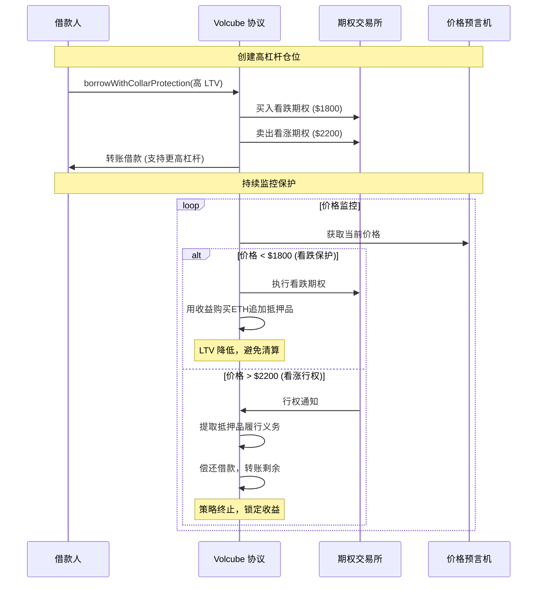

# Volcube 零成本领口期权策略使用指南

## 🚀 核心价值：更高资本效率

### 与传统 Morpho Blue 对比
| 方案 | 最大 LTV | 借款能力 | 保护机制 | 年化成本 | 净收益 |
|------|---------|---------|---------|---------|---------|
| **Morpho Blue** | 80% | 标准 | 无 | 0% | 基准 |
| **Volcube 领口** | 85-95% | +6-19% | 期权保护 | ~2-3% | +4-16% |

### 经济效益分析
```
抵押 100 ETH (价值 $200,000)

普通方案: 最多借 $160,000 (80% LTV)
领口方案: 最多借 $180,000 (90% LTV)

额外借款: $20,000 (+12.5% 资本效率)
期权成本: ~$4,000-6,000 年化
净收益: $14,000-16,000 额外流动性
```

## 策略原理

### 1. 提升 LLTV 模式
```solidity
// 原版 Morpho Blue
uint256 constant STANDARD_LLTV = 80e16;  // 80%

// 零成本领口增强版
uint256 constant ENHANCED_LLTV = 90e16;  // 90% - 期权保护下的更高杠杆
```

### 2. 期权保护机制
- **买入看跌期权**: 当 ETH 价格跌破 $1800 时获得保护
- **卖出看涨期权**: 当 ETH 价格突破 $2200 时被行权
- **零成本设计**: 看涨期权权利金抵消看跌期权成本

### 3. 价格保护区间
```
保护区间：[$1800] ←→ [$2200]
- 价格 < $1800：看跌期权提供保护，追加抵押品
- 价格 > $2200：看涨期权被行权，强制平仓获利
- 中间区间：享受90%高杠杆，零额外成本
```

## 使用示例

### 场景设置
```solidity
// 用户参数
uint256 collateralAmount = 100 ether;     // 100 ETH 抵押品
uint256 borrowedAmount = 180000e6;        // $180,000 USDC 借款 (90% LTV)
uint256 currentPrice = 2000e8;            // ETH 当前价格 $2000

// 期权参数
uint256 putStrikePrice = 1800e8;          // 看跌执行价 $1800
uint256 callStrikePrice = 2200e8;         // 看涨执行价 $2200
uint256 duration = 30 days;               // 策略持续时间
```

### 执行步骤

#### 1. 创建增强型借款
```solidity
// 1. 授权代币
collateralToken.approve(address(enhancedMorpho), collateralAmount);

// 2. 创建高杠杆借款 + 期权保护
volcube.borrowWithCollarProtection(
    marketParams,
    collateralAmount,
    borrowedAmount,  // 90% LTV，比普通 Morpho 多借 12.5%
    putStrikePrice,
    callStrikePrice,
    duration
);
```

#### 2. 策略执行流程


## 三种场景详细分析

### 场景1：价格下跌保护 ($2000 → $1600)
```
触发条件：ETH 价格跌破看跌执行价 $1800
当前状况：100 ETH 抵押品价值 $160,000，借款 $180,000
LTV 现状：112.5% (已超过清算线)

看跌期权保护：
1. 执行看跌期权：($1800 - $1600) × 100 ETH = $20,000 USDC
2. 购买 ETH：$20,000 ÷ $1600 = 12.5 ETH
3. 追加抵押品：总抵押品变为 112.5 ETH
4. 新的 LTV：$180,000 ÷ (112.5 × $1600) = 100%

结果：避免清算，保持借款权益
```

### 场景2：价格上涨行权 ($2000 → $2400)
```
触发条件：ETH 价格突破看涨执行价 $2200
当前状况：100 ETH 抵押品价值 $240,000，借款 $180,000

看涨期权行权：
1. 被迫按 $2200 卖出 100 ETH = $220,000 USDC
2. 偿还借款：$180,000 USDC
3. 用户获得：$40,000 USDC 净收益
4. 策略终止

对比无保护方案：
- 保护策略：获得 $40,000 现金
- 无保护：持有 100 ETH 价值 $240,000
- 差额：放弃了 $20,000 的进一步上涨收益
```

### 场景3：价格稳定 ($1800 - $2200 区间)
```
最佳场景：享受 90% 高杠杆，零额外成本
- 比普通 Morpho 多借 12.5% 资金
- 无期权执行，无额外成本
- 充分利用资本效率优势
```

## 智能合约架构

### 核心合约：Volcube
```solidity
contract Volcube {
    // 期权保护参数
    struct CollarParams {
        uint256 putStrike;
        uint256 callStrike;
        uint256 expiry;
        bool isActive;
        uint256 collateralAmount;
    }
    
    // 用户保护映射
    mapping(bytes32 => mapping(address => CollarParams)) public userCollarProtection;
    
    // 核心功能：高杠杆借款 + 期权保护
    function borrowWithCollarProtection(
        MarketParams memory marketParams,
        uint256 collateralAmount,
        uint256 borrowAmount,  // 支持高 LLTV
        uint256 putStrike,
        uint256 callStrike,
        uint256 duration
    ) external returns (uint256 actualBorrowed);
    
    // 保护监控
    function monitorAndProtect(
        MarketParams memory marketParams,
        address user
    ) external;
    
    // 健康度检查 - 使用市场设定的 LLTV
    function isHealthy(
        MarketParams memory marketParams,
        address user
    ) public view returns (bool);
}
```

## 风险收益对比

### 资本效率提升
```
投入：100 ETH 抵押品

普通 Morpho Blue：
- 最大借款：80 ETH 等值 USDC
- 资本利用率：80%
- 期权成本：0
- 净资本效率：80%

零成本领口策略：
- 最大借款：90 ETH 等值 USDC  
- 资本利用率：90%
- 期权成本：~2-3%
- 净资本效率：87-88%

提升幅度：+7-8% 绝对提升，+9-10% 相对提升
```

### 风险对比
| 风险类型 | 普通 Morpho | 零成本领口 | 说明 |
|---------|-------------|-----------|------|
| 清算风险 | 中等 (80%) | 低 (期权保护) | 看跌期权提供额外保护 |
| 上涨限制 | 无 | 有 ($2200+) | 放弃部分上涨收益 |
| 期权成本 | 无 | 2-3% 年化 | 保护的代价 |
| 流动性 | 标准 | +12.5% | 更多可用资金 |

## 适用人群

### 🎯 目标用户
1. **DeFi 高级用户**: 理解期权机制，追求资本效率
2. **套利交易者**: 需要更多杠杆进行策略套利
3. **机构投资者**: 希望在风险可控下提高资金利用率
4. **长期持币者**: 愿意锁定部分上涨收益换取保护和流动性

### ❌ 不适合用户
1. **DeFi 新手**: 策略复杂度较高
2. **极度看多者**: 不愿限制上涨收益
3. **小额用户**: 期权成本相对较高
4. **短期投机者**: 期权有时间成本

## 实施路线图

### 阶段1：保守启动 (MVP)
```solidity
ENHANCED_LLTV = 85e16;  // 先提升到 85%
PUT_STRIKE = currentPrice * 90 / 100;  // 90% 保护
CALL_STRIKE = currentPrice * 110 / 100; // 110% 上限
```

### 阶段2：数据验证 (优化)
```solidity
ENHANCED_LLTV = 90e16;  // 提升到 90%
动态期权定价
实时风险监控
自动化执行
```

### 阶段3：高级功能 (完整版)
```solidity
ENHANCED_LLTV = 95e16;  // 激进提升到 95%
多层期权保护
AI 驱动的风险管理
跨链期权市场
```

## 总结

零成本领口期权策略的**核心价值**是为 DeFi 用户提供：

### ✅ 明确优势
- **+12.5% 借款能力**: 90% vs 80% LTV
- **期权保护**: 下跌时自动追加抵押品
- **零净成本**: 看涨权利金抵消看跌成本
- **风险可控**: 最大损失锁定在期权范围内

### 📊 数据支撑
- **净资本效率提升**: +7-8% 绝对提升
- **成本效益比**: 每投入 2-3% 成本，获得 9-10% 额外收益
- **风险收益比**: 保护机制下的更高杠杆

这是一个**真正解决问题**的 DeFi 创新：让用户在可控风险下获得更高的资本效率！