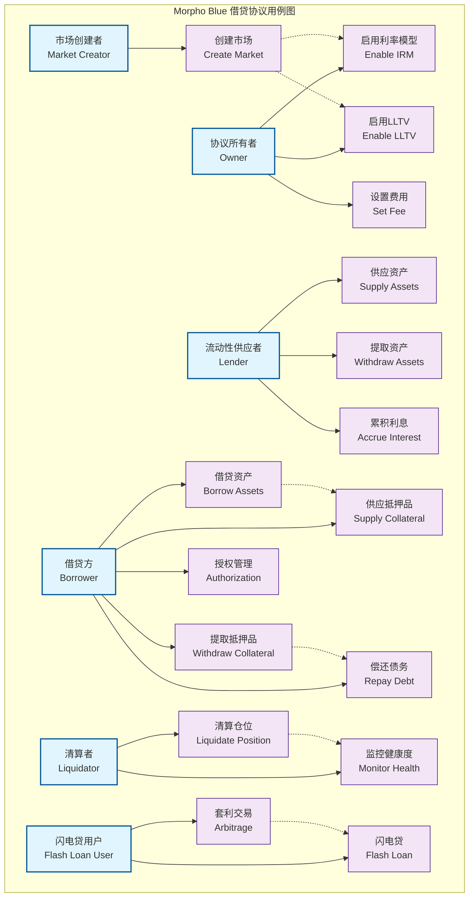
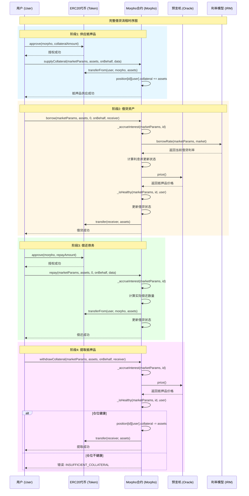
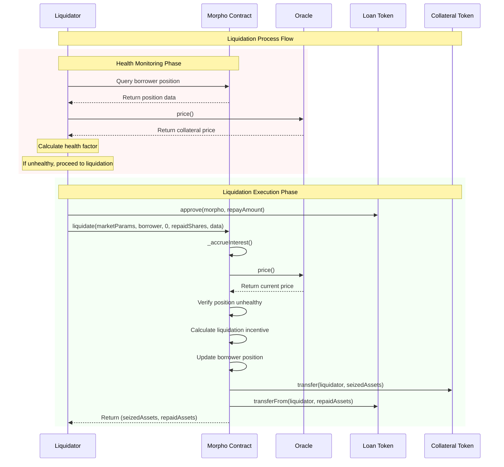

# Morpho Blue Protocol 使用指南

## 协议概述

Morpho Blue 是一个去中心化借贷协议，允许用户在隔离市场中供应和借用资产。每个市场由特定参数定义：借贷代币（loanToken）、抵押品代币（collateralToken）、预言机（oracle）、利率模型（IRM）和贷款价值比（LLTV）。

### 核心特性
- **隔离市场**：每个市场完全独立，无交叉抵押
- **无需许可**：任何人都可以创建新市场
- **自动利息累积**：基于利用率的动态利率
- **高效清算**：激励机制保护协议安全
- **闪电贷**：单笔交易内的无抵押借贷

## 核心 API 函数详解

### 市场管理

#### `createMarket(MarketParams memory marketParams)`
创建新的借贷市场

**参数**：
- `marketParams`: 市场参数结构体
  - `loanToken`: 借贷代币地址
  - `collateralToken`: 抵押品代币地址  
  - `oracle`: 价格预言机地址
  - `irm`: 利率模型地址
  - `lltv`: 贷款价值比（18位小数，如 0.8e18 = 80%）

**前置条件**：
- IRM 必须被协议所有者启用
- LLTV 必须被协议所有者启用
- 市场不能已存在

**权限**：任何人（无需许可）

**示例**：
```solidity
MarketParams memory params = MarketParams({
    loanToken: 0xA0b86a33E6411C2D2e5F9e4e6B6D1e6D8E9F2C3D,
    collateralToken: 0xC02aaA39b223FE8D0A0e5C4F27eAD9083C756Cc2,
    oracle: 0x5f4eC3Df9cbd43714FE2740f5E3616155c5b8419,
    irm: 0x870aC11D48B15DB9a138Cf899d20F13F79Ba00BC,
    lltv: 860000000000000000 // 86%
});
morpho.createMarket(params);
```

#### `setFee(MarketParams memory marketParams, uint256 newFee)`
设置市场的协议费用

**参数**：
- `marketParams`: 市场参数
- `newFee`: 新费率（最大50%，WAD格式）

**权限**：仅协议所有者

### 供应/借出操作

#### `supply(MarketParams memory marketParams, uint256 assets, uint256 shares, address onBehalf, bytes calldata data)`
向市场供应资产以赚取利息

**参数**：
- `marketParams`: 市场参数
- `assets`: 资产数量（如果指定shares则为0）
- `shares`: 份额数量（如果指定assets则为0）
- `onBehalf`: 受益人地址
- `data`: 回调数据

**返回值**：`(actualAssets, actualShares)`

**注意事项**：
- `assets` 和 `shares` 必须恰好有一个为0
- 需要事先授权代币
- 可选择实现 `IMorphoSupplyCallback` 接口

**错误处理**：
- `MARKET_NOT_CREATED`: 市场不存在
- `INCONSISTENT_INPUT`: 参数不一致
- `ZERO_ADDRESS`: 地址为零

#### `withdraw(MarketParams memory marketParams, uint256 assets, uint256 shares, address onBehalf, address receiver)`
提取供应的资产

**权限要求**：账户所有者或授权地址

**流动性检查**：提取后市场必须保持足够流动性

### 借贷操作

#### `borrow(MarketParams memory marketParams, uint256 assets, uint256 shares, address onBehalf, address receiver)`
基于抵押品借用资产

**健康度检查**：借贷后仓位必须保持健康（抵押品价值 * LLTV ≥ 借贷价值）

**流动性检查**：市场必须有足够的可借资产

#### `repay(MarketParams memory marketParams, uint256 assets, uint256 shares, address onBehalf, bytes calldata data)`
偿还借贷资产

**权限**：任何人都可以为他人偿还

### 抵押品管理

#### `supplyCollateral(MarketParams memory marketParams, uint256 assets, address onBehalf, bytes calldata data)`
供应抵押品以启用借贷

**Gas 优化**：不累积利息以节省gas

#### `withdrawCollateral(MarketParams memory marketParams, uint256 assets, address onBehalf, address receiver)`
提取抵押品

**健康度检查**：提取后仓位必须保持健康

### 清算机制

#### `liquidate(MarketParams memory marketParams, address borrower, uint256 seizedAssets, uint256 repaidShares, bytes calldata data)`
清算不健康仓位

**清算条件**：目标仓位必须不健康（健康度 < 1）

**激励机制**：清算者以折扣价获得抵押品

**清算公式**：
```
清算激励因子 = min(MAX_LIQUIDATION_INCENTIVE_FACTOR, 1/(1 - cursor*(1 - lltv)))
```

### 闪电贷

#### `flashLoan(address token, uint256 assets, bytes calldata data)`
在同一交易内进行无抵押借贷

**回调要求**：必须实现 `IMorphoFlashLoanCallback.onMorphoFlashLoan`

**偿还要求**：必须在同一交易内偿还

### 授权管理

#### `setAuthorization(address authorized, bool newIsAuthorized)`
授权其他地址管理您的仓位

#### `setAuthorizationWithSig(Authorization memory authorization, Signature calldata signature)`
使用 EIP-712 签名设置授权

## 用户角色和交互场景


### 1. 市场创建者
**职责**：创建新的借贷市场

**完整流程**：
1. 等待协议所有者启用所需的 IRM 和 LLTV
2. 调用 `createMarket(marketParams)`
3. 市场现在可用于借贷

**最佳实践**：
- 选择可靠的预言机
- 确保代币流动性充足
- 设置合理的 LLTV 参数

### 2. 流动性供应者/借出方
**职责**：供应资产赚取利息

**标准流程**：
1. 授权 Morpho 合约使用借贷代币
2. 调用 `supply()` 提供资产
3. 获得供应份额代表池中的权益
4. 利息自动累积
5. 调用 `withdraw()` 退出仓位

**风险管理**：
- 监控利用率变化
- 注意流动性风险
- 关注协议费用变化

### 3. 借贷方
**职责**：抵押资产借贷其他资产

**标准流程**：
1. 授权抵押品代币
2. 调用 `supplyCollateral()` 提供抵押品
3. 在 LLTV 限制内调用 `borrow()`
4. 使用借贷资产
5. 调用 `repay()` 偿还债务
6. 偿还后调用 `withdrawCollateral()` 提取抵押品

**健康度管理**：
```solidity
健康度 = (抵押品价值 * LLTV) / 借贷价值
// 健康度 ≥ 1: 健康
// 健康度 < 1: 可被清算
```


### 4. 清算者
**职责**：清算不健康仓位获得利润

**套利流程**：
1. 监控仓位健康状态
2. 发现不健康仓位时：
   - 计算最优清算数量
   - 授权偿还代币
   - 调用 `liquidate()`
   - 以折扣价获得抵押品
3. 出售抵押品获利

**盈利计算**：
```solidity
利润 = 获得抵押品价值 - 偿还债务价值
```



### 5. 协议所有者
**管理职责**：

**启用组件**：
- `enableIrm(irmAddress)`: 启用利率模型
- `enableLltv(lltvValue)`: 启用贷款价值比

**费用管理**：
- `setFee(marketParams, feeRate)`: 设置市场费用
- `setFeeRecipient(newRecipient)`: 设置费用接收方

**治理**：
- `setOwner(newOwner)`: 转移所有权

### 6. 闪电贷用户
**应用场景**：套利、清算、再融资等

**实现示例**：
```solidity
contract FlashLoanArbitrage is IMorphoFlashLoanCallback {
    function executeArbitrage() external {
        morpho.flashLoan(USDC_ADDRESS, 100000e6, abi.encode("arbitrage"));
    }
    
    function onMorphoFlashLoan(uint256 assets, bytes calldata data) external {
        // 执行套利逻辑
        // 确保合约有足够代币偿还
        require(
            IERC20(USDC).balanceOf(address(this)) >= assets, 
            "Insufficient balance for repayment"
        );
    }
}
```

## 核心概念深入解析

### 健康因子计算
```solidity
健康因子 = (抵押品价值 * LLTV) / 借贷价值

// 示例：
// 抵押品：1 ETH = $2000
// LLTV：80%
// 借贷：$1200 USDC
// 健康因子 = ($2000 * 0.8) / $1200 = 1.33 (健康)
```

### 份额与资产转换
- **资产（Assets）**：实际代币数量
- **份额（Shares）**：按比例的权益，随利息增长而增值
- **转换公式**：
  ```solidity
  份额转资产: assets = shares * totalSupplyAssets / totalSupplyShares
  资产转份额: shares = assets * totalSupplyShares / totalSupplyAssets
  ```

### 利息累积机制
1. **连续复利**：基于时间和利用率
2. **利率模型**：根据供需关系动态调整
3. **协议费用**：从利息中扣除，以份额形式给费用接收方

### 市场隔离
- **独立风险**：每个市场风险完全隔离
- **无交叉抵押**：不支持跨市场抵押
- **独立参数**：每个市场有独立的风险参数

## 安全注意事项

### 智能合约风险
- **预言机风险**：市场依赖外部价格预言机
- **利率模型风险**：所有者可升级利率模型
- **清算风险**：抵押品价值下跌可能导致清算
- **授权风险**：谨慎授权其他地址

### 最佳实践
1. **风险分散**：不要将所有资金投入单一市场
2. **健康度监控**：保持足够的健康度缓冲
3. **流动性考虑**：大额操作前检查市场流动性
4. **授权管理**：定期审查授权列表

### 常见错误和解决方案

| 错误 | 原因 | 解决方案 |
|------|------|----------|
| `MARKET_NOT_CREATED` | 市场不存在 | 检查市场参数或先创建市场 |
| `INSUFFICIENT_COLLATERAL` | 抵押品不足 | 增加抵押品或减少借贷 |
| `INSUFFICIENT_LIQUIDITY` | 流动性不足 | 等待供应增加或减少操作数量 |
| `UNAUTHORIZED` | 无权限操作 | 检查授权状态 |
| `INCONSISTENT_INPUT` | 参数不一致 | 确保资产和份额恰好一个为0 |

## Gas 优化策略

### 最优实践
1. **使用份额参数**：避免额外计算
2. **批量操作**：合并多个操作
3. **手动利息累积**：在某些场景下可节省gas
4. **闪电贷复合操作**：减少多次交易

### Gas 消耗估算
- `supply()`: ~50,000 gas
- `withdraw()`: ~60,000 gas
- `borrow()`: ~70,000 gas
- `repay()`: ~55,000 gas
- `liquidate()`: ~100,000 gas
- `flashLoan()`: ~40,000 gas (不含回调)

## 高级用例

### 1. 自动化清算机器人
```solidity
contract LiquidationBot {
    function checkAndLiquidate(MarketParams memory marketParams, address borrower) external {
        if (!morpho.isHealthy(marketParams, borrower)) {
            // 计算最优清算数量
            uint256 optimalRepayAmount = calculateOptimalLiquidation(marketParams, borrower);
            morpho.liquidate(marketParams, borrower, 0, optimalRepayAmount, "");
        }
    }
}
```

### 2. 收益聚合器
```solidity
contract YieldAggregator {
    function rebalance() external {
        // 寻找最高收益市场
        MarketParams memory bestMarket = findBestYieldMarket();
        
        // 从当前市场提取
        morpho.withdraw(currentMarket, type(uint256).max, 0, address(this), address(this));
        
        // 投入最佳市场
        morpho.supply(bestMarket, balance, 0, address(this), "");
    }
}
```

### 3. 杠杆交易策略
```solidity
contract LeverageTrader {
    function openLeveragePosition(uint256 collateralAmount, uint256 leverage) external {
        // 1. 供应初始抵押品
        morpho.supplyCollateral(marketParams, collateralAmount, address(this), "");
        
        // 2. 递归借贷以实现杠杆
        for (uint i = 0; i < leverage - 1; i++) {
            uint256 borrowAmount = calculateBorrowAmount();
            morpho.borrow(marketParams, borrowAmount, 0, address(this), address(this));
            
            // 将借贷资产转换为更多抵押品
            uint256 additionalCollateral = swapToCollateral(borrowAmount);
            morpho.supplyCollateral(marketParams, additionalCollateral, address(this), "");
        }
    }
}
```

## API 参考快查

### 主要函数签名
```solidity
// 市场管理
function createMarket(MarketParams memory marketParams) external;
function setFee(MarketParams memory marketParams, uint256 newFee) external;

// 供应操作
function supply(MarketParams memory marketParams, uint256 assets, uint256 shares, address onBehalf, bytes calldata data) external returns (uint256, uint256);
function withdraw(MarketParams memory marketParams, uint256 assets, uint256 shares, address onBehalf, address receiver) external returns (uint256, uint256);

// 借贷操作  
function borrow(MarketParams memory marketParams, uint256 assets, uint256 shares, address onBehalf, address receiver) external returns (uint256, uint256);
function repay(MarketParams memory marketParams, uint256 assets, uint256 shares, address onBehalf, bytes calldata data) external returns (uint256, uint256);

// 抵押品管理
function supplyCollateral(MarketParams memory marketParams, uint256 assets, address onBehalf, bytes calldata data) external;
function withdrawCollateral(MarketParams memory marketParams, uint256 assets, address onBehalf, address receiver) external;

// 清算
function liquidate(MarketParams memory marketParams, address borrower, uint256 seizedAssets, uint256 repaidShares, bytes calldata data) external returns (uint256, uint256);

// 闪电贷
function flashLoan(address token, uint256 assets, bytes calldata data) external;

// 授权
function setAuthorization(address authorized, bool newIsAuthorized) external;
function setAuthorizationWithSig(Authorization memory authorization, Signature calldata signature) external;
```

### 重要结构体
```solidity
struct MarketParams {
    address loanToken;
    address collateralToken;
    address oracle;
    address irm;
    uint256 lltv;
}

struct Position {
    uint128 supplyShares;
    uint128 borrowShares;
    uint128 collateral;
}

struct Market {
    uint128 totalSupplyAssets;
    uint128 totalSupplyShares;
    uint128 totalBorrowAssets;
    uint128 totalBorrowShares;
    uint128 lastUpdate;
    uint128 fee;
}
```

---

*本文档基于 Morpho Blue 协议的最新版本编写，使用前请确认版本兼容性。如有疑问，请参考官方文档或源代码。*
